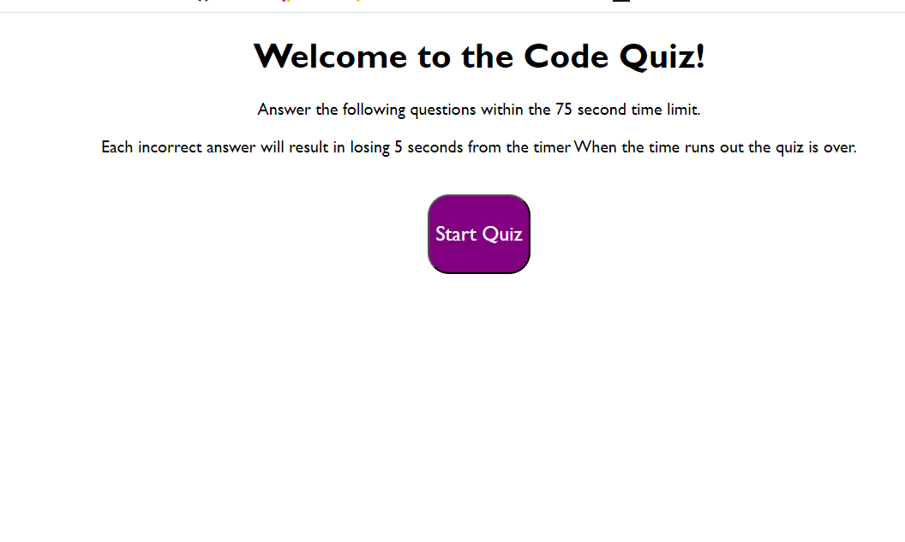

# Challenge-4-WebApisCodeQuiz

# Challenge-4
WebApisCodeQuiz

## Description

This challenge focused on building a timed coding quiz with multiple choice questions. The app is updated via html and css powered by javascript. 

- What was your motivation?
I wanted to create an interactive quiz that demonstrated challenges and be able to understand how a set of functions can determine an outcome.

## Credits

Followed the ASU Bootcamp tutorials shown in the ASU-VIRT-FSF-PT-06-2023-U-LOLC. 

## License

No license

--- 
